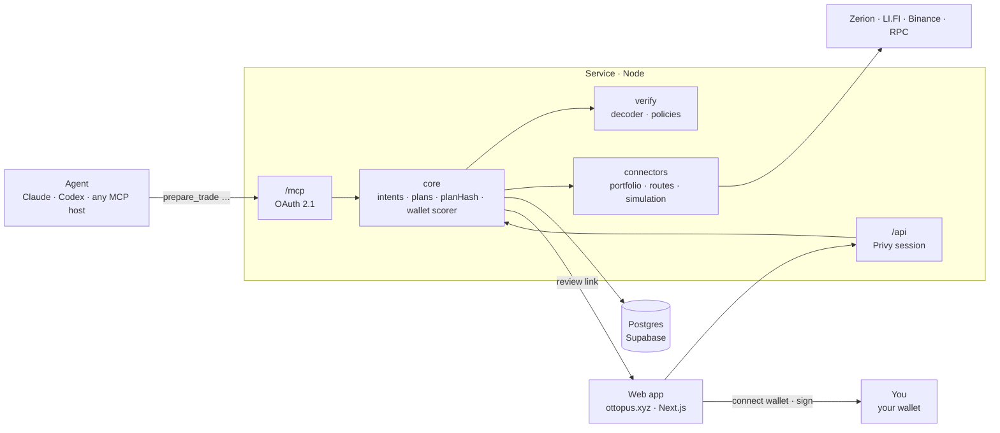

# Ottopus

**Stop juggling wallets to get one thing done.**

Tell your agent what you want, not where to find it. Ottopus works out which wallet,
which chain and which app, then shows you exactly what will happen before anything
moves. You sign it in your own wallet.

**One intent. Every wallet. You still sign.**

Live at **[ottopus.xyz](https://ottopus.xyz)**.

## How it works

1. **Link your wallets.** Sign in with Google, email or a wallet, then link the rest:
   hardware, hot, or a Safe. Ottopus only ever reads them.
2. **Point your agent at Ottopus.** One URL, any agent that speaks MCP. Nothing to
   install.
3. **Say what you want.** *"Buy me NVIDIA token using 10 USDC."* Ottopus picks a
   wallet and says why, builds the route, decodes and simulates it, and hands you a
   review link. You open it, connect that wallet, and sign.

Ottopus is not a wallet and not an agent with keys. It sits between your agent and
your wallets: it plans, explains and simulates. Your wallet stays the final authority.

## Use it with your agent

Link a wallet at [ottopus.xyz](https://ottopus.xyz), then add the server to your
agent. The first call opens a consent page where you choose what the agent may do.

```sh
# Claude Code
claude mcp add --transport http ottopus https://mcp.ottopus.xyz

# Codex
codex mcp add ottopus --url https://mcp.ottopus.xyz

# Hermes
hermes mcp add ottopus --url https://mcp.ottopus.xyz
```

Any other MCP host works the same way: it is a remote server over Streamable HTTP
with OAuth 2.1, so there is no local process and no key to paste. Web hosts such as
Claude.ai connect through their connectors settings with the same URL.

The agent gets these tools:

| Tool | What it does |
|---|---|
| `whoami` | Who the agent is acting for, and what the grant permits |
| `list_wallets` | The linked wallets: name, chain, software, whether it can sign |
| `get_portfolio` | Balances and DeFi positions across every linked wallet |
| `find_asset` | Turn a symbol or contract address into an asset id |
| `find_stock` | Every provider’s token for a stock, with prices, premium and market state |
| `prepare_transfer` | A plan to send a token or native currency |
| `prepare_trade` | A plan to swap, or to bridge across chains |
| `prepare_custom` | Calls the agent wrote itself, held to a declaration of what they do |
| `get_plan` | Whether a plan has been signed, and what happened on chain |
| `cancel_plan` | Withdraw a plan before it is signed |

Every `prepare_*` tool returns a plan and a review link. Nothing the agent does moves
funds. The review page shows the decoded calls, the simulation, and anything worth
reading first, such as an approval, before you connect the wallet and sign.

## Architecture



Two deployables in one pnpm workspace. The service holds all the logic and answers
on two surfaces: `/mcp` for agents and `/api` for the web app. The web app only
renders what the service returns; it never computes or verifies a plan itself.

Four rules define the product:

1. **No private key ever reaches the backend or the agent.** Ownership is proved
   through Privy's wallet-link flow; the service only ever sees addresses. An
   agent-operated wallet's key lives with its vendor, and Ottopus still only
   sees the address.
2. **Tool calls create plans, not transactions.** Prepare, never surprise. One
   stated exception, for agent-operated wallets only: once a person has approved
   a plan on the review page, or a rule the person set has approved it after a
   passing simulation, `get_plan` hands the agent that plan's calls and the
   agent's own wallet sends them. Ottopus still never signs and never broadcasts.
3. **The review page is a hard security boundary**, bound to an immutable `planHash`.
   A tampered or expired plan will not sign, and will not release its calls.
4. **Simulation is independent of whoever built the route.** The routing vendor is
   never the simulation vendor. A second, labelled simulation from Binance may
   appear on the review page for a person to compare; it is advice, and never
   enters the prepare path, the verification or the hash.

## Run it locally

You need Node 22, pnpm 10 and a Postgres database (Supabase works). A Privy app id
is needed to sign in; everything else is optional and degrades gracefully.

```sh
pnpm install

cp service/.env.example service/.env      # DATABASE_URL, PRIVY_APP_ID, PRIVY_JWT_VERIFICATION_KEY
cp web/.env.example web/.env.local        # NEXT_PUBLIC_PRIVY_APP_ID, NEXT_PUBLIC_API_URL

pnpm db:migrate                           # applies pending migrations, safe to re-run
pnpm dev                                  # web on :3000, service on :8787
```

Optional keys in `service/.env`: `ZERION_API_KEY` for portfolios, `LIFI_API_KEY`
and `BINANCE_WEB3_API_KEY`/`BINANCE_WEB3_SECRET_KEY` for routing, `RPC_URL_TEMPLATE`
for a faster RPC provider. Each file explains what happens without it.

To reach `/mcp` from an agent host during development, expose the service over HTTPS
(for example `cloudflared tunnel --url http://localhost:8787`) and set `PUBLIC_URL`
to that address. OAuth 2.1 requires TLS, so hosts refuse plain `http://`.

Useful commands:

```sh
pnpm test          # both packages
pnpm typecheck
pnpm lint
pnpm db:generate   # after editing service/src/db/schema.ts
```

CI runs typecheck, lint, tests and a build on every push. The service deploys from
`service/Dockerfile`; the web app is a standard Next.js build.

## Layout

```
web/       Next.js app: sign in, wallets, portfolio, activity, /review/[planId], OAuth consent
service/   Node service: /mcp and /api over one core
  src/core         intents, plans, planHash, the wallet scorer
  src/verify       decoder and plan policies
  src/connectors   portfolio, route and simulation adapters
  src/mcp          the MCP server and its tools
  src/oauth        OAuth 2.1 for agent hosts
  src/db           Drizzle schema and migrations
```
