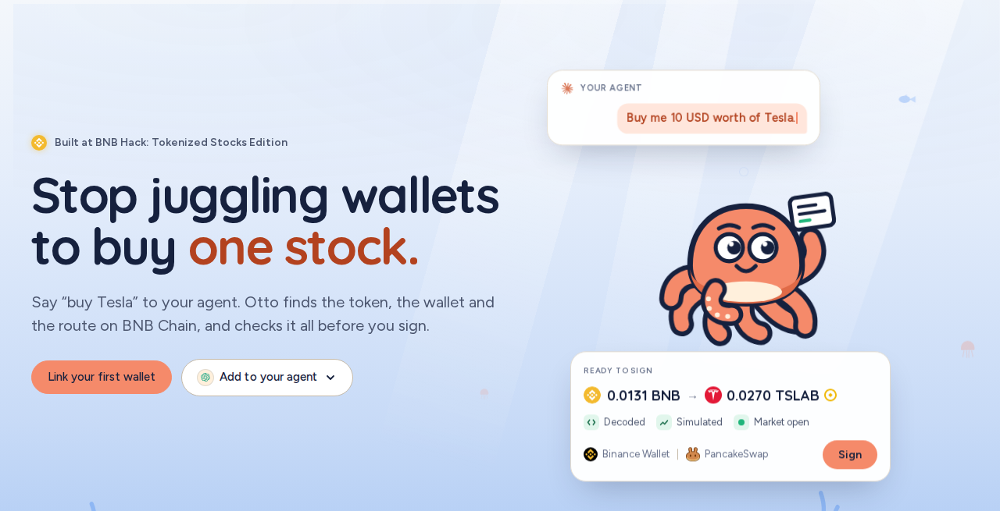
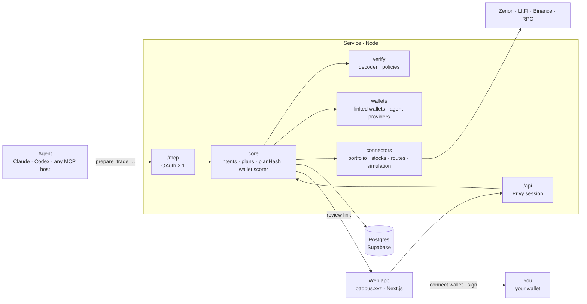

<div align="center">


<h1>Ottopus</h1>

<p><strong>Stop juggling wallets to buy one stock.</strong></p>

<p>
Tell your agent what you want. Ottopus picks the wallet, builds the route, decodes and<br />
simulates it, and hands you a review link. Works with any agent that speaks MCP.
</p>

<p>
<a href="https://ottopus.xyz">Website</a> ·
<a href="#how-it-works">How it works</a> ·
<a href="#use-it-with-your-agent">Quick start</a> ·
<a href="#what-works-today">Features</a> ·
<a href="#architecture">Architecture</a> ·
<a href="#run-it-locally">Run it locally</a> ·
<a href="#contributing">Contributing</a>
</p>

<p>
<a href="https://github.com/ottopusxyz/ottopus/actions/workflows/ci.yml"></a>
<a href="LICENSE"></a>
</p>

<p>Being built for <strong>BNB Hack: Tokenized Stocks Edition</strong>.</p>

<a href="https://ottopus.xyz"></a>

</div>

## Why

Buying one tokenized stock onchain takes a wallet, a chain, a token contract, a route
and a leap of faith. Ottopus sits between your agent and your wallets and does the
working out: it plans, explains and simulates, then shows you exactly what will happen
before anything moves.

It is not a wallet and not an agent with keys. Your wallet stays the final authority.

## How it works

1. **Link your wallets.** Sign in with Google, email or a wallet, then link the rest:
   hardware, hot, a Safe, or a wallet your agent operates. Ottopus only ever reads them.
2. **Point your agent at Ottopus.** One URL, any agent that speaks MCP. Nothing to
   install.
3. **Say what you want.** *"Buy me 10 USD worth of Tesla."* Ottopus finds the token,
   picks a wallet and says why, builds the route, decodes and simulates it, and hands
   you a review link. You open it, connect that wallet, and sign.

## Use it with your agent

Link a wallet at [ottopus.xyz](https://ottopus.xyz), then add the server to your
agent. The first call opens a consent page where you choose what the agent may do.

```sh
# Claude Code
claude mcp add --transport http ottopus https://mcp.ottopus.xyz/mcp

# Codex
codex mcp add ottopus --url https://mcp.ottopus.xyz/mcp

# Hermes
hermes mcp add ottopus --url https://mcp.ottopus.xyz/mcp
```

Any other MCP host works the same way: it is a remote server over Streamable HTTP
with OAuth 2.1, so there is no local process and no key to paste. Web hosts such as
Claude.ai connect through their connectors settings with the same URL.

The agent gets these tools:

| Tool | What it does |
|---|---|
| `whoami` | Who the agent is acting for, and what the grant permits |
| `list_wallets` | The linked wallets: name, chain, software, whether it can sign |
| `get_portfolio` | Balances and DeFi positions across every linked wallet |
| `find_asset` | Turn a symbol or contract address into an asset id |
| `find_stock` | Every provider’s token for a stock, with prices, premium and market state |
| `prepare_transfer` | A plan to send a token or native currency |
| `prepare_trade` | A plan to swap, or to bridge across chains |
| `prepare_custom` | Calls the agent wrote itself, held to a declaration of what they do |
| `get_plan` | Whether a plan has been signed, and what happened on chain |
| `cancel_plan` | Withdraw a plan before it is signed |
| `link_agent_wallet_start` | A challenge for a wallet the agent operates to sign with its vendor CLI |
| `link_agent_wallet_finish` | Link that wallet if the signature recovers to its address |

Every `prepare_*` tool returns a plan and a review link. Nothing the agent does moves
funds. The review page shows the decoded calls, the simulation, and anything worth
reading first, such as an approval, before you connect the wallet and sign.

Linking a wallet from the agent is the one permission that is never on by default.
It is a switch on the consent page, and it stays off unless you turn it on.

### Claude Code plugin

The plugin shows each plan as a card above your prompt and follows it until it is
signed, confirmed or expired. It brings the MCP server with it.

```
/plugin marketplace add ottopusxyz/ottopus
/plugin install ottopus@ottopus
```

More in [`plugin/README.md`](plugin/README.md).

## What works today

- **Transfers, swaps and bridges** across EVM chains, with Binance asked first for
  swaps on BNB Chain and LI.FI everywhere else.
- **Tokenized stocks on BNB Chain.** Ask by ticker or company name and get every
  issuer's token (bStocks, Ondo and others) with its price, its premium over the
  share, and whether the market is open.
- **A wallet picked with a stated reason**, from every wallet you have linked.
- **A review page bound to the plan's hash**: decoded calls, a simulation that is
  independent of the router, and a second, labelled simulation from Binance to compare.
- **Agent wallets.** An agent can link a wallet it operates (Binance Agentic Wallet)
  by signing a challenge with the vendor's CLI. Its key never leaves the vendor.
- **A plan card in Claude Code** that tracks a plan from prepared to confirmed.

In progress: letting an agent wallet send a plan you approved. Approve mode on the
review page and a per-wallet auto-execute rule are open issues, so today every plan
is still signed in a wallet you connect.

## Architecture


```mermaid
flowchart LR
    Agent["Agent<br/>Claude · Codex · any MCP host"]
    Web["Web app<br/>ottopus.xyz · Next.js"]
    You["You<br/>your wallet"]

    subgraph Service["Service · Node"]
        MCP["/mcp<br/>OAuth 2.1"]
        API["/api<br/>Privy session"]
        Core["core<br/>intents · plans · planHash · wallet scorer"]
        Verify["verify<br/>decoder · policies"]
        Wallets["wallets<br/>linked wallets · agent providers"]
        Connectors["connectors<br/>portfolio · stocks · routes · simulation"]
    end

    DB[("Postgres<br/>Supabase")]
    Vendors["Zerion · LI.FI · Binance · RPC"]

    Agent -- "prepare_trade …" --> MCP
    Web --> API
    MCP --> Core
    API --> Core
    Core --> Verify
    Core --> Wallets
    Core --> Connectors
    Connectors --> Vendors
    Core --> DB
    Core -- "review link" --> Web
    Web -- "connect wallet · sign" --> You
```

Two deployables in one pnpm workspace. The service holds all the logic and answers
on two surfaces: `/mcp` for agents and `/api` for the web app. The web app only
renders what the service returns; it never computes or verifies a plan itself.

Four rules define the product:

1. **No private key ever reaches the backend or the agent.** Ownership is proved
   through Privy's wallet-link flow; the service only ever sees addresses. An
   agent-operated wallet's key lives with its vendor, and Ottopus still only
   sees the address.
2. **Tool calls create plans, not transactions.** Prepare, never surprise. One
   stated exception, for agent-operated wallets only and still being built: once a
   person has approved a plan on the review page, or a rule the person set has
   approved it after a passing simulation, `get_plan` hands the agent that plan's
   calls and the agent's own wallet sends them. Ottopus still never signs and never
   broadcasts.
3. **The review page is a hard security boundary**, bound to an immutable `planHash`.
   A tampered or expired plan will not sign, and will not release its calls.
4. **Simulation is independent of whoever built the route.** The routing vendor is
   never the simulation vendor. A second, labelled simulation from Binance may
   appear on the review page for a person to compare; it is advice, and never
   enters the prepare path, the verification or the hash.

## Run it locally

You need Node 22 or newer, pnpm 10 and a Postgres database (Supabase works). A Privy
app id is needed to sign in; everything else is optional and degrades gracefully.

```sh
pnpm install

cp service/.env.example service/.env      # DATABASE_URL, PRIVY_APP_ID, PRIVY_JWT_VERIFICATION_KEY
cp web/.env.example web/.env.local        # NEXT_PUBLIC_PRIVY_APP_ID, NEXT_PUBLIC_API_URL

pnpm db:migrate                           # applies pending migrations, safe to re-run
pnpm dev                                  # web on :3000, service on :8787
```

Optional keys in `service/.env`: `ZERION_API_KEY` for portfolios, `LIFI_API_KEY`
for a higher routing rate limit, `BINANCE_WEB3_API_KEY`/`BINANCE_WEB3_SECRET_KEY`
for BNB Chain routing, stock data and the second simulation, `RPC_URL_TEMPLATE`
for a faster RPC provider. Each file explains what happens without it.

To reach `/mcp` from an agent host during development, expose the service over HTTPS
(for example `cloudflared tunnel --url http://localhost:8787`) and set `PUBLIC_URL`
to that address. OAuth 2.1 requires TLS, so hosts refuse plain `http://`.

Useful commands:

```sh
pnpm test          # both packages
pnpm typecheck
pnpm lint
pnpm db:generate   # after editing service/src/db/schema.ts
```

CI runs typecheck, lint, tests and a build on every pull request and on `main`. The
service deploys from `service/Dockerfile`; the web app is a standard Next.js build.

## Layout

```
web/       Next.js app: sign in, wallets, portfolio, activity, /review/[token], OAuth consent
service/   Node service: /mcp and /api over one core
  src/core         intents, plans, planHash, the wallet scorer
  src/verify       decoder and plan policies
  src/connectors   portfolio, stock, route and simulation adapters
  src/wallets      linked wallets and agent wallet providers
  src/mcp          the MCP server and its tools
  src/oauth        OAuth 2.1 for agent hosts
  src/db           Drizzle schema and migrations
plugin/    Claude Code plugin: the plan card
```

## Contributing

Issues and pull requests are welcome. One issue per pull request, branched off
`main`, with conventional commits scoped by area (`feat(mcp):`, `fix(web):`). Run
`pnpm typecheck && pnpm lint && pnpm test` before you open it, and add tests for
anything that touches plan hashing, verification or the review boundary.

## License

[MIT](LICENSE)
